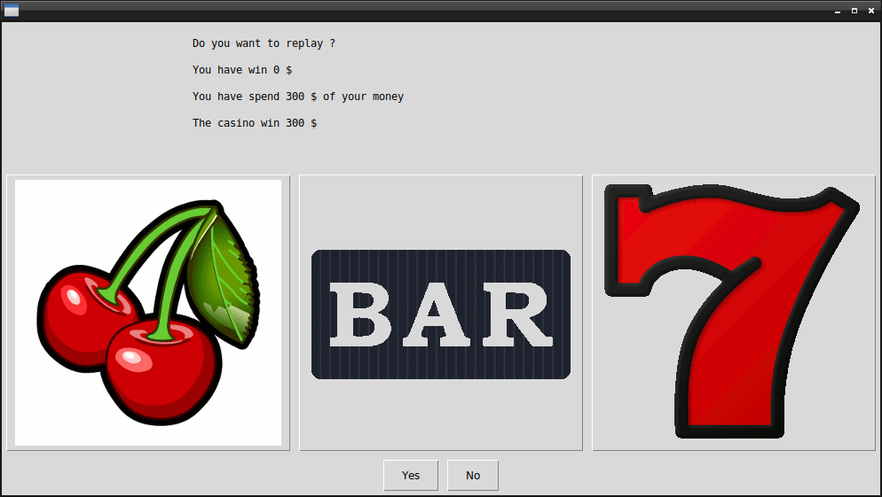

# Casino Slot Machine

## What's this game ?  

This is a casino slot machine simulator. Everytime you play, you bet 100$ of your money.  

## Rules of the game  

1) You Begin with 100$  
2) You always have the choice to leave or replay.  
If You leave you can keep the money you have got   
3) Everytime you replay, you bet 100$  
4) 2 x the same = your money + 200$, 3 x the same = your money +300$   
   All different = you loose everything   


  


## What you need to make it work :  

This game is made for Python 3.  

Install all the packages for : Python 3.  

easygui at least version 0.98  

```sh
sudo python3 -m pip install --upgrade easygui  
```  

install simpleaudio  

```sh
pip3 install simpleaudio  
```  

## How to launch the game :  

```sh
python3 CasinoSlot.py
```  


## Developer - Author  

Hamdy Abou El Anein  

